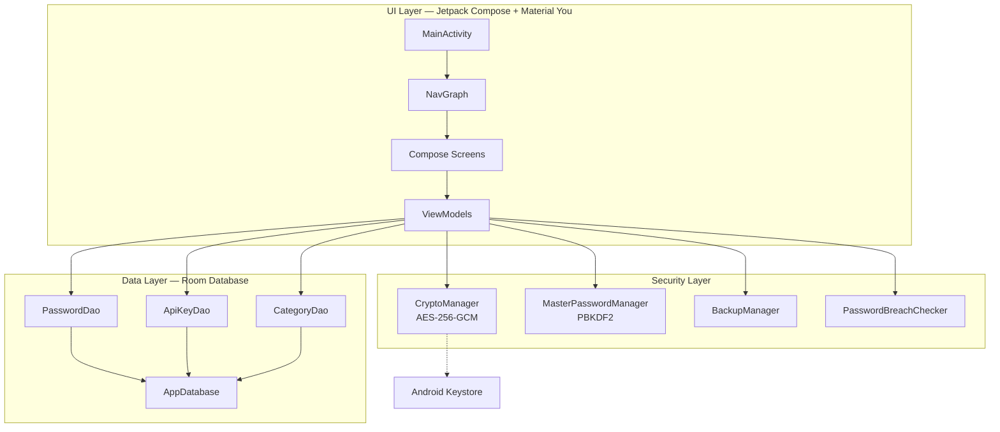

# AIPOS Password Manager

A premium, fully offline, and highly secure Android application for storing passwords and API keys. Designed with modern Material You guidelines (dynamic colors), hardware-backed cryptography via Android Keystore, and a local-first architecture.

[](https://kotlinlang.org)
[](https://developer.android.com)
[](https://developer.android.com/training/articles/keystore)
[](https://github.com/gininaba/AIPOSPasswordManager)

---

## Features

* **Dual Vault Support**: Seamlessly manage credentials (passwords, usernames, URLs) and API keys with a tailored developer experience.
* **Material You Design**: Sleek dark/light modes with dynamic styling matching the user's system colors, elegant micro-animations, and fluid transitions.
* **Custom Categories**: Organize credentials into custom folders/categories with inline creation, edit/delete capabilities, and responsive list filter chips.
* **Hardened Security**:
  * **AES-256-GCM** encryption for all stored credentials with hardware-backed keys inside the **Android Keystore**.
  * **PBKDF2 with HmacSHA256** (120k iterations) for master password verification.
  * **EncryptedSharedPreferences** to safely cache user authentication metadata.
  * Native **Biometric Prompt** support (`BIOMETRIC_STRONG`).
* **Portable Encrypted Backups**: Export and import your local database to an encrypted JSON backup file. Decoupled from hardware keys using a custom user backup password derived via PBKDF2 (10,000 iterations) + AES-256-GCM, allowing seamless transfer across devices.
* **Offline Breach Check**: Real-time evaluation of master passwords and entry credentials against a bundled database of common weak passwords—without making a single network request.
* **Auto-Lock Timeout**: Configurable inactivity timers (Immediately, 1 min, 5 min, 10 min, Never) to keep your vault secure when backgrounded.
* **100% Offline & Private**: Zero network permissions declared in `AndroidManifest.xml`. Your data never leaves your device.

---

## Architecture

The application is built on modern Android development practices using **Jetpack Compose**, **Room Database**, and a **Model-View-ViewModel (MVVM)** architecture pattern.



---

## Tech Stack and Dependencies

* **Language**: Kotlin 2.x
* **UI**: Jetpack Compose with Material 3 and Navigation Compose
* **Local Database**: Room 2.7.x with Kotlin Symbol Processing (KSP)
* **Serialization**: Gson 2.11.x
* **Biometrics**: AndroidX Biometric API
* **Security and Preferences**: Jetpack Security Crypto

---

## Getting Started

### Prerequisites

* Android Studio Koala / Ladybug or newer
* Android SDK 35+
* JDK 17

### Building the Project

Clone the repository and build the debug APK using Gradle:

```bash
# Compile and run unit tests
./gradlew test

# Build debug APK
./gradlew assembleDebug
```

The output APK will be generated at: `app/build/outputs/apk/debug/app-debug.apk`.

### Installing on Device

With an active emulator or connected USB device:

```bash
./gradlew installDebug
```

---

## Recent Improvements & Fixes

* **Database Integrity**: Deleting custom categories now automatically and atomically resets the category of all associated passwords and API keys to "Uncategorized" (`null` reference) via a database transaction. This prevents dangling category references and database pointer mismatch bugs.
* **Hardened Backup Parsing**: The backup import engine is now fully null-safe, utilizing Kotlin's nullable compiler-checks and safe defaults to gracefully handle incomplete, legacy, or manually edited JSON backup files without throwing runtime `NullPointerException` crashes.
* **Authentication Stability**: Fixed an issue where attempting to unlock the vault with an empty master password could cause the application to crash due to cryptography exceptions. The UI now properly validates input before attempting decryption.

---

## Security Specifications

| Layer | Implementation | Details |
|---|---|---|
| **Encryption at Rest** | AES-256-GCM | Random IV generated per entry |
| **Key Management** | Android Keystore | Hardware-backed cryptographic keys |
| **Master Authentication** | PBKDF2WithHmacSHA256 | 120,000 iterations + cryptographically secure salt |
| **Backup Encryption** | PBKDF2 + AES-256-GCM | 10,000 iterations for backup key derivation |
| **Secure Preferences** | EncryptedSharedPreferences | Keys encrypted using AES256_SIV, values using AES256_GCM |
| **Network Footprint** | None | No `INTERNET` permission declared |
