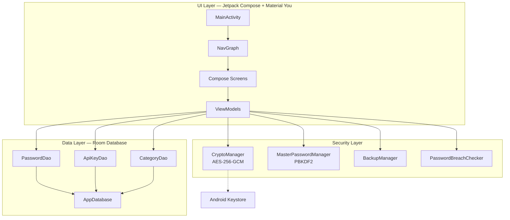

# AIPOS Password Manager

A premium, fully offline, and highly secure Android application for storing passwords and API keys. Designed with modern Material You guidelines (dynamic colors), hardware-backed cryptography via Android Keystore, and a local-first architecture.

[](https://kotlinlang.org)
[](https://developer.android.com)
[](https://developer.android.com/training/articles/keystore)
[](https://github.com/gininaba/AIPOSPasswordManager)

---

## Features

* **Dual Vault Support**: Seamlessly manage credentials (passwords, usernames, URLs) and API keys with a tailored developer experience.
* **Premium Design System**: A custom trust-centric visual identity featuring:
  * **Trust-Centric Palette**: Deep teal-blue (primary), soft indigo (secondary), and warm amber gold (tertiary) colors providing a safe, reliable feel.
  * **Material You Integration**: Falls back beautifully to system-derived dynamic styling on Android 12+.
  * **Semantic Indicators**: Consistent green/amber/red color-coding for password strength, vault health status, and security alerts.
  * **Polished Typography**: Refined Sans-Serif font hierarchy with custom letter-spacing.
* **Animated Vault Health Dashboard**: A central dashboard featuring an animated health score circle (which glows upon reaching 100% security), staggered entrance animations, quick actions, and visual favorited indicators.
* **Secure Setup & Onboarding**: A step-by-step onboarding wizard featuring requirements checklist checkmark animations, warning cards for weak master passwords, and clear trust information.
* **Interactive Vault Lists**: Easily scan entries with left-accented category markers, initial-letter avatars, and a fluid red-gradient swipe-to-delete gesture.
* **Custom Categories**: Organize credentials into custom folders/categories with inline creation, edit/delete capabilities, and responsive list filter chips.
* **Hardened Security**:
  * **AES-256-GCM** encryption for all stored credentials with hardware-backed keys inside the **Android Keystore**.
  * **PBKDF2 with HmacSHA256** (120k iterations) for master password verification.
  * **EncryptedSharedPreferences** to safely cache user authentication metadata.
  * Native **Biometric Prompt** support (`BIOMETRIC_STRONG`).
* **Portable Encrypted Backups**: Export and import your local database to an encrypted JSON backup file. Decoupled from hardware keys using a custom user backup password derived via PBKDF2 (10,000 iterations) + AES-256-GCM, allowing seamless transfer across devices.
* **Offline Breach Check**: Real-time evaluation of master passwords and entry credentials against a bundled database of common weak passwords—without making a single network request.
* **Built-in 2FA Authenticator (TOTP)**: Generate time-based one-time passwords directly within the app. Stores Base32 secrets encrypted at rest and calculates codes completely offline without needing a separate authenticator app.
* **Auto-Lock Timeout**: Configurable inactivity timers (Immediately, 1 min, 5 min, 10 min, Never) to keep your vault secure when backgrounded.
* **100% Offline & Private**: Zero network permissions declared in `AndroidManifest.xml`. Your data never leaves your device.

---

## Architecture

The application is built on modern Android development practices using **Jetpack Compose**, **Room Database**, and a **Model-View-ViewModel (MVVM)** architecture pattern.



---

## Tech Stack and Dependencies

* **Language**: Kotlin 2.x
* **UI**: Jetpack Compose with Material 3 and Navigation Compose
* **Local Database**: Room 2.7.x with Kotlin Symbol Processing (KSP)
* **Serialization**: Gson 2.11.x
* **Biometrics**: AndroidX Biometric API
* **Security and Preferences**: Jetpack Security Crypto

---

## Getting Started

### Prerequisites

* Android Studio Koala / Ladybug or newer
* Android SDK 35+
* JDK 17

### Building the Project

Clone the repository and build the debug APK using Gradle:

```bash
# Compile and run unit tests
./gradlew test

# Build debug APK
./gradlew assembleDebug
```

The output APK will be generated at: `app/build/outputs/apk/debug/app-debug.apk`.

### Installing on Device

With an active emulator or connected USB device:

```bash
./gradlew installDebug
```

---

## Recent Improvements & Fixes

* **Advanced Features & Tactile Animation Polish (v1.2.0)**:
  * **Offline TOTP QR Code Scanner**: Scan 2FA QR codes directly inside the app to auto-fill TOTP fields. Frames are analyzed 100% offline and locally using CameraX and ZXing.
  * **Master Password Emergency Recovery Key**: Generates a cryptographically secure 16-character alphanumeric key (e.g. `AIPOS-XXXX-XXXX-XXXX-XXXX`) during setup or settings. Allows vault resets on master password lockouts without network dependencies.
  * **Third-Party CSV Vault Importers**: Import credentials from Bitwarden, KeePass, and 1Password CSV exports. The file is processed main-safely and encrypted in the local database.
  * **Decluttered Dashboard Layout**: Overhauled the main dashboard by consolidating the redundant Summary Cards and Quick Action Grid into two large, unified, clickable summary cards with embedded inline floating `+` buttons. Replaced visual gradients with a solid clean background to match standard Material M3 palettes.
  * **Spring-like Tactile Interaction**: Exposes custom scale-on-press modifiers (`bounceClick` and `pressScale`) to provide spring-scale tactile transitions on card items, settings options, primary buttons, and FABs.
  * **Smooth Screen Transitions**: Implemented slide-in/slide-out navigation globally for screen navigations (sliding left/right and popping right/left).
  * **List Animations**: Applied `Modifier.animateItem()` to Favorites, Passwords, and API Keys lists for smooth visual updates when items are added, deleted, restored, or filtered.
  * **Prevented Camera frame lockups**: Fixed a critical bug in `QrCodeAnalyzer` where buffer reading exceptions could leave image frames open, freezing the camera preview. Added a `try-finally` block to guarantee frame cleanup.
  * **Clipboard Timer Reset**: Fixed a race condition where copying multiple credentials sequentially would trigger premature clipboard clearing. Reschedules now cancel previous timers.
* **Comprehensive UI/UX Production Polish (v1.1.0)**:
  * **Brand-New Trust-Centric Design**: Migrated the default violet theme to a premium teal-blue and soft indigo palette, using rounded corners (8–32dp) and optimized hierarchy.
  * **Animated Vault Health Meter**: Overhauled the home dashboard with a dynamic circular gauge color-coded by strength, glowing on a 100% score, and utilizing slide-in/fade-in staggered entrance transitions.
  * **Visual Security Indicators**: Integrated strict green/amber/red semantic colors across strength meters, generators, lists, and detail views.
  * **Trust & Authentication Details**: Refined the login screen with a gradient-backed animating shield icon, frosted-glass input layout, security encryption info badges, and keyboard-submit compatibility. Added requirements checkboxes with animated checkmarks, and breach warning indicators to onboarding.
  * **Polished Lists**: Introduced left color-accent separators, initial-letter avatars, username styling icons, and a fluid red-gradient swipe-to-delete behavior.
  * **Interactive Haptics**: Integrated tactically placed haptic vibrations when generating passwords, copying items, or submitting passwords.
  * **Health Card Bug Fixes**: Corrected transparency/outline issues to improve color contrast, and replaced jittery scale animations with a cleaner look.
* **Unified Tab Navigation**: Revamped the Bottom Navigation Bar so that switching between Home, Passwords, and API Keys swaps content in-place with smooth crossfades, rather than pushing new pages onto the navigation stack. This drastically improves the native feel and eliminates back-button confusion.
* **Real-time Security Feedback**: Integrated a dynamic password strength meter and a compromised password warning directly into the credential detail pages.
* **Security Hardening**: 
  * Upgraded PBKDF2 iterations for backup encryption keys to 100,000.
  * Added 250ms debouncing to password strength checks to prevent UI thread blocking on heavy cryptographic operations.
* **Database Integrity**: Deleting custom categories automatically resets associated entries to "Uncategorized" via a database transaction, preventing pointer mismatch bugs.
* **Hardened Backup Parsing**: The import engine is now fully null-safe, preventing crashes on incomplete or manually edited legacy JSON backups.
* **Authentication Stability**: Fixed edge cases where an empty master password could cause cryptography exceptions during unlocking.
* **Production Stability Hardening**:
  * Fixed concurrent Flow collection leaks in ViewModels by cancelling prior flow jobs before launching new ones.
  * Added screen lifecycle `DisposableEffect` cleanups to reset selection states and prevent details bleed/flashing when entering different credential screens.
  * Fixed swipe-to-dismiss undo data loss where restoring a password would lose its TOTP secret key and reset timestamps. Undo operations now insert original encrypted objects back to the database directly.
---

## Security Specifications

| Layer | Implementation | Details |
|---|---|---|
| **Encryption at Rest** | AES-256-GCM | Random IV generated per entry |
| **Key Management** | Android Keystore | Hardware-backed cryptographic keys |
| **Master Authentication** | PBKDF2WithHmacSHA256 | 120,000 iterations + cryptographically secure salt |
| **Backup Encryption** | PBKDF2 + AES-256-GCM | 10,000 iterations for backup key derivation |
| **Secure Preferences** | EncryptedSharedPreferences | Keys encrypted using AES256_SIV, values using AES256_GCM |
| **Network Footprint** | None | No `INTERNET` permission declared |
