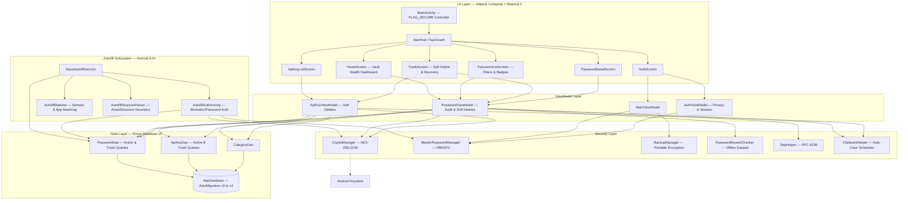

# AIPOS Password Manager

A premium, fully offline, and highly secure Android application for storing passwords and API keys. Designed with modern Material You guidelines (dynamic colors), hardware-backed cryptography via Android Keystore, native Android Autofill service, and a local-first architecture.

[](https://kotlinlang.org)
[](https://developer.android.com)
[](https://developer.android.com/training/articles/keystore)
[](https://github.com/gininaba/AIPOSPasswordManager)
[](https://f-droid.org/packages/com.aipos.aipospm/)

---

## Features

* **Dual Vault Support**: Seamlessly manage credentials (passwords, usernames, URLs, notes) and API keys with a tailored developer experience.
* **Native Android Autofill Service**: Autofill usernames and passwords directly into Android applications and web browsers (Chrome, Firefox, Brave) via Android's native Autofill Framework.
  * **Biometric & Master Password Gate**: Credentials are never decrypted or exposed to calling apps without explicit biometric or master password authentication.
  * **Smart Domain & App Matching**: Intelligent heuristic matching against web host domains and Android application package names.
  * **Interactive Vault Search**: Dedicated "Search in AIPOS Vault..." integration to search, unlock, and fill any vault credential on demand.
* **Trash & 30-Day Recovery (Soft Deletion)**:
  * **Accidental Deletion Protection**: Deleted credentials are moved into the Trash rather than permanently erased.
  * **Dedicated Trash Screen**: Tabbed view switching between Passwords and API Keys, accessible via Settings > General > Trash.
  * **Retention Countdown**: Visual badges display remaining retention time (e.g. `29d left`, `Today`).
  * **Restoration & Purging**: Single-tap restore to active vault, per-item permanent deletion, bulk empty trash, and automated 30-day SQLite auto-purge upon app launch.
* **Reused & Duplicate Password Audit**:
  * **Local Duplicate Detection**: Identifies identical passwords across multiple accounts completely offline without external transmission.
  * **Vault Health Score Impact**: Dynamic health score penalty combining both breached and reused entries.
  * **Amber Status Warnings**: Dedicated amber status banners and an amber `Reused (N)` filter chip for rapid identification and remediation.
* **Screen Privacy Protection (`FLAG_SECURE`)**:
  * **Anti-Snooping Guard**: Enforces Android's `FLAG_SECURE` window attribute to block screenshots, prevent screen recordings, and hide credential previews in the OS Recent Apps overview.
  * **Configurable Toggle**: Easily enabled or disabled under Settings > Security > Screen Privacy, dynamically applied at runtime.
* **Offline Breach Check & Action Navigation**: Real-time evaluation of master passwords and entry credentials against a bundled database of common weak/breached passwords without network access. Tapping the Vault Health action banner instantly opens the Passwords tab with pre-selected compromised password filtering and prominent red warning badges.
* **Animated Vault Health Dashboard**: Central dashboard featuring a real-time circular health gauge, entrance animations, quick summary metrics, favorites carousel, and direct action banners for compromised and reused credentials.
* **Built-in 2FA Authenticator (TOTP)**: Generate time-based one-time passwords (RFC 6238) offline. Includes an integrated camera scanner powered by CameraX and ZXing to scan 2FA QR codes locally without external tools.
* **Premium Design System**:
  * **Trust-Centric Palette**: Deep teal-blue (primary), soft indigo (secondary), and warm amber gold (tertiary) providing a reliable visual identity.
  * **Material You Dynamic Colors**: Adapts seamlessly to system-derived palettes on Android 12+.
  * **Solid Card Containers**: 100% opaque card surfaces (`surfaceContainerLow`) prevent swipe background icons from bleeding through resting cards.
  * **Tactile Spring Animations**: Custom bounce scale modifiers on interactive cards, buttons, and floating action buttons.
* **Hardened Security**:
  * **AES-256-GCM** encryption with 128-bit authentication tags and hardware-backed keys in the **Android Keystore**.
  * **PBKDF2 with HmacSHA256** (120,000 iterations) for master password hashing.
  * **EncryptedSharedPreferences** for secure storage of cryptographic salts and app preferences.
  * Native **Biometric Prompt** support (`BIOMETRIC_STRONG` for fingerprint and 3D face unlock).
  * **Emergency Recovery Key**: 16-character alphanumeric key (`AIPOS-XXXX-XXXX-XXXX-XXXX`) for emergency vault reset if the master password is lost.
* **Portable Encrypted Backups & CSV Importers**: Export and import encrypted JSON backups decoupled from device hardware keys using PBKDF2 (10,000 iterations) + AES-256-GCM. Direct CSV imports supported for Bitwarden, KeePass, and 1Password.
* **Auto-Lock Timeout**: Configurable inactivity timers (Immediately, 30s, 1m, 5m, 10m, Never) to keep credentials protected when backgrounded.
* **100% Offline & Private**: Zero network permissions declared in `AndroidManifest.xml`. Your data never leaves your device.

---

## Documentation Suite

Comprehensive technical, security, and usage documentation is available in the `docs/` directory:

* [Architecture & Technical Specifications](docs/ARCHITECTURE.md): System architecture, layer diagrams, Autofill subsystem, and concurrency optimizations.
* [Security Specifications & Threat Model](docs/SECURITY.md): Cryptographic algorithms, key management, threat analysis, and security mitigations.
* [Developer & Contributor Guide](docs/DEVELOPER_GUIDE.md): Development prerequisites, directory structure, build/test commands, and UI guidelines.
* [User Manual & Vault Health Handbook](docs/USER_GUIDE.md): Setup instructions, 2FA TOTP configuration, autofill guide, and backup workflows.

---

## Architecture

The application is built on modern Android development practices using **Jetpack Compose**, **Room Database (v4)**, and a **Model-View-ViewModel (MVVM)** architecture pattern.


```mermaid
graph TB
    subgraph UI_Layer["UI Layer — Jetpack Compose + Material 3"]
        MA["MainActivity — FLAG_SECURE Controller"]
        NAV["NavHost / NavGraph"]
        HS["HomeScreen — Vault Health Dashboard"]
        PLS["PasswordListScreen — Filters & Badges"]
        KLS["ApiKeyListScreen"]
        TS["TrashScreen — Soft Delete & Recovery"]
        PDS["PasswordDetailScreen"]
        AS["AuthScreen"]
    end

    subgraph ViewModel_Layer["ViewModel Layer"]
        PVM["PasswordViewModel — Audit & Soft Deletes"]
        KVM["ApiKeyViewModel — Soft Deletes"]
        MVM["MainViewModel"]
        AVM["AuthViewModel — Privacy & Session"]
    end

    subgraph Security_Layer["Security Layer"]
        CM["CryptoManager — AES-256-GCM"]
        MPM["MasterPasswordManager — PBKDF2"]
        BM["BackupManager — Portable Encryption"]
        PBC["PasswordBreachChecker — Offline Dataset"]
        TH["TotpHelper — RFC 6238"]
        CH["ClipboardHelper — Auto-Clear Scheduler"]
    end

    subgraph Autofill_Subsystem["Autofill Subsystem — Android 8.0+"]
        AAS["AiposAutofillService"]
        AAA["AutofillAuthActivity — Biometric/Password Auth"]
        AM["AutofillMatcher — Domain & App Matching"]
        ASP["AutofillStructureParser — AssistStructure Heuristics"]
    end

    subgraph Data_Layer["Data Layer — Room Database v4"]
        DB[("AppDatabase — AutoMigration v3 to v4")]
        PD["PasswordDao — Active & Trash Queries"]
        AD["ApiKeyDao — Active & Trash Queries"]
        CD["CategoryDao"]
    end

    MA --> NAV
    NAV --> HS & PLS & KLS & TS & PDS & AS
    HS & PLS & TS & PDS --> PVM
    KLS & TS --> KVM
    AS --> MVM & AVM

    AAS --> ASP & AM & AAA
    AAS --> PD
    AAA --> CM & MPM & PD

    PVM & KVM --> CM
    PVM & KVM --> PD & AD & CD
    PVM --> PBC
    PVM --> TH
    PVM & KVM --> CH
    MVM --> MPM & BM
    AVM --> MPM

    PD & AD & CD --> DB
    CM -.-> KS["Android Keystore"]
```

---

## Tech Stack and Dependencies

* **Language**: Kotlin 2.x
* **UI**: Jetpack Compose with Material 3 and Navigation Compose
* **Local Database**: Room 2.7.x with Kotlin Symbol Processing (KSP) and AutoMigration (v3 to v4)
* **System Integration**: Android Autofill Framework (`AutofillService`, API 26+)
* **Hardware Cryptography**: Android Keystore (`AES/GCM/NoPadding`, 256-bit keys)
* **Security & Preferences**: Jetpack Security Crypto (`EncryptedSharedPreferences`)
* **Biometrics**: AndroidX Biometric API (`BIOMETRIC_STRONG`)
* **Camera & QR Processing**: CameraX and ZXing (100% offline image analysis)
* **Serialization**: Gson 2.11.x

---

## Getting Started

### Installation (F-Droid)

AIPOS Password Manager is fully compliant with the F-Droid inclusion policy. You can download and install it via the official F-Droid app store:

<a href="https://f-droid.org/packages/com.aipos.aipospm/">
  
</a>

### Prerequisites

* Android Studio Koala / Ladybug or newer
* Android SDK 35+ (Minimum SDK 26)
* JDK 17

### Building the Project

Clone the repository and build the debug APK using Gradle:

```bash
# Compile and run unit tests
./gradlew test

# Build debug APK
./gradlew assembleDebug
```

The output APK will be generated at: `app/build/outputs/apk/debug/app-debug.apk`.

### Installing on Device

With an active emulator or connected USB device:

```bash
./gradlew installDebug
```

---

## Recent Improvements & Fixes

* **Advanced Privacy, Trash & Autofill Ecosystem (v1.4.0)**:
  * **Native Android Autofill Service**: Built-in `AutofillService` supporting system-wide credential autofill in native apps and mobile browsers. Encrypted credentials remain gated behind biometric or master password authentication via `AutofillAuthActivity`.
  * **Trash / Soft-Delete & Recovery**: Credentials are moved into a 30-day soft-delete repository before permanent removal. Dedicated Trash screen with dual tabs, remaining-day countdown indicators, single-tap restore, per-item permanent deletion, and empty trash commands. Database upgraded to version 4 with Room AutoMigration.
  * **Reused / Duplicate Password Auditing**: Automatic single-pass vault analysis flagging passwords reused across multiple accounts. Reused entries trigger amber status banners, dynamic health score reductions, amber badge indicators, and dedicated `Reused (N)` category filtering.
  * **Screen Privacy Toggle (`FLAG_SECURE`)**: Added dynamic window flag protection under Settings > Security, allowing users to toggle protection against screenshots, screen recorders, and task switcher previews.
* **Vault Health Compromised Password Filtering & Visual Highlighting (v1.3.0)**:
  * **Direct Action Navigation**: Tapping the Vault Health status card on the Home screen directly opens the Passwords tab with a pre-selected Compromised filter chip active.
  * **Visual Warning Badges & Solid Card Surfaces**: Compromised password cards are highlighted with a prominent red Compromised warning badge, red shield avatar, red left accent bar, and red card border. Solid opaque card containers (`surfaceContainerLow`) eliminate ghost icon bleed-through during swipe interactions.
  * **Dedicated Filter Chip**: Added a red `Compromised (N)` chip to the filter bar for one-tap security filtering, alongside an empty state with a "Show All Passwords" action button.
  * **Production Documentation Suite**: Added comprehensive architecture, security, developer, and user guides in the `docs/` folder.
* **Layout & Navigation Polish (v1.2.5)**:
  * **Scaffold FAB Snackbar Lifting**: Connected `Scaffold` snackbar host states across Home, Password, and API Key screens so Material 3 automatically lifts the Floating Action Button (`+`) whenever an "Undo" toast appears.
  * **Original List Order Preservation on Undo**: Fixed item re-ordering on deletion undo by maintaining original `updatedAt` timestamps during restoration.
* **Usability & Swipe-to-Delete Refinements (v1.2.2)**:
  * **Reliable Undo Restoration**: Restored items get re-inserted with the current timestamp to appear immediately at the top of sorted lists.
  * **Accidental Delete Prevention**: Configured swipe-to-dismiss threshold to 50% card width, preventing diagonal scroll motions from accidentally triggering deletion.
  * **Descriptive Delete Confirmations**: Contextualized undo alerts to show the name of the specific item deleted.
* **Large Vault Scroll Performance (v1.2.1)**:
  * **Optimized Vault Health Computations**: Offloaded cryptographically heavy Keystore decryption tasks to background execution using `Dispatchers.Default`.
  * **Debounced Database Emissions**: Implemented a 300ms debounce on list flow changes to group rapid database updates into a single sweep.
* **Advanced Features & Tactile Animation Polish (v1.2.0)**:
  * **Offline TOTP QR Code Scanner**: Scan 2FA QR codes directly inside the app using CameraX and ZXing 100% offline.
  * **Master Password Emergency Recovery Key**: Generates a 16-character alphanumeric key during setup or settings for emergency vault reset.
  * **Third-Party CSV Vault Importers**: Main-safe encrypted import from Bitwarden, KeePass, and 1Password CSV exports.
  * **Decluttered Dashboard Layout**: Consolidated redundant summary cards and quick action grids into unified summary cards with embedded floating `+` buttons.
  * **Spring-like Tactile Interaction**: Added custom scale-on-press modifiers (`bounceClick` and `pressScale`) across cards, buttons, and FABs.
  * **Smooth Screen Transitions**: Implemented slide navigation transitions globally.
  * **List Animations**: Applied `Modifier.animateItem()` to Favorites, Passwords, and API Keys lists.
  * **Complete Emoji-to-Icon Migration**: Replaced all raw emojis across screens with standard Material Design 3 icons inside Row layouts.
* **Comprehensive UI/UX Production Polish (v1.1.0)**:
  * **Brand-New Trust-Centric Design**: Migrated to a premium teal-blue and soft indigo palette with refined corner radiuses and hierarchy.
  * **Animated Vault Health Meter**: Overhauled dashboard with a dynamic circular gauge color-coded by strength, glowing at 100% score.
  * **Visual Security Indicators**: Strict green/amber/red semantic colors across strength meters, generators, lists, and detail views.
  * **Trust & Authentication Details**: Refined login screen with gradient shield icon, frosted input layout, and security badges.
  * **Interactive Haptics**: Integrated haptic feedback when generating passwords, copying items, or submitting credentials.

---

## Security Specifications

| Specification | Technology / Standard | Details |
|---|---|---|
| **Encryption at Rest** | AES-256-GCM | 256-bit key in Android Keystore, 12-byte random IV per entry, 128-bit auth tag |
| **Key Management** | Android Keystore | Hardware-backed cryptographic keys (TEE / StrongBox when available) |
| **Master Authentication** | PBKDF2WithHmacSHA256 | 120,000 iterations + 16-byte cryptographically secure random salt |
| **Backup Encryption** | PBKDF2 + AES-256-GCM | 10,000 iterations for backup key derivation using user password |
| **Secure Preferences** | EncryptedSharedPreferences | Keys encrypted using AES256_SIV, values using AES256_GCM |
| **Biometric Security** | AndroidX Biometric API | Enforces `BIOMETRIC_STRONG` (hardware fingerprint or 3D face unlock) |
| **Screen Privacy** | WindowManager `FLAG_SECURE` | Blocks OS screenshots, screen recording, and Recent Apps task previews |
| **Autofill Protection** | Authenticated Fill Intents | Decrypted credentials require biometric/master password authentication |
| **Clipboard Security** | Auto-Clearing Clipboard | Scheduled 30-second clipboard wipe with timer rescheduling |
| **Network Footprint** | None | 100% Offline with zero `INTERNET` permissions declared |

---

## License

This project is licensed under the Apache License, Version 2.0. See the [LICENSE](LICENSE) file for the full license text.

<div align="center">
  <sub>ジンsan Design | gininaba</sub>
</div>
