# AIPOS Password Manager — Architecture & Technical Specifications

## 1. Executive Summary

**AIPOS Password Manager** (`com.aipos.aipospm`) is a 100% offline, local-first Android application designed with zero network dependencies (`INTERNET` permission is omitted in `AndroidManifest.xml`). It combines hardware-backed encryption via the **Android Keystore**, modern Jetpack Compose UI with Material 3 styling, and a clean **MVVM (Model-View-ViewModel)** architecture.

---

## 2. Layered Architecture

```mermaid
graph TB
    subgraph UI_Layer["UI Layer (Jetpack Compose + Material 3)"]
        MA[MainActivity — FLAG_SECURE & Cache Flusher]
        NAV[NavHost / NavGraph]
        HS[HomeScreen — Vault Health Dashboard]
        PLS[PasswordListScreen — Filters, Sort & Badges]
        KLS[ApiKeyListScreen — Filters & Sort]
        CMS[CategoryManagerScreen — Tabbed Management & Presets]
        TS[TrashScreen — Soft Delete & Restore]
        PDS[PasswordDetailScreen]
        PGS[PasswordGeneratorScreen]
        IPB[IconPickerBottomSheet — Curated Icon Selector]
        VIR[VaultIconRegistry — Material Vector Mapping]
        AS[AuthScreen]
    end

    subgraph ViewModel_Layer["ViewModel Layer"]
        PVM[PasswordViewModel — Fast Filter, Audit & Decryption Cache]
        KVM[ApiKeyViewModel — Soft Deletes & Sort]
        CVM[CategoryViewModel — Type-Segregated & Preset Engine]
        AVM[AuthViewModel — Privacy & Session]
        GVM[PasswordGeneratorViewModel]
    end

    subgraph Security_Layer["Security Layer"]
        CM[CryptoManager — AES-256-GCM]
        MPM[MasterPasswordManager — PBKDF2 & Preferences]
        BM[BackupManager — Portable Encryption]
        PBC[PasswordBreachChecker — Offline Dataset]
        TH[TotpHelper — RFC 6238 Generator]
        CH[ClipboardHelper — Auto-Clear Scheduler]
        DC[(In-Memory Session Decryption Cache)]
    end

    subgraph Autofill_Subsystem["Autofill Subsystem (Android 8.0+)"]
        AAS[AiposAutofillService — AutofillService]
        AAA[AutofillAuthActivity — Biometric/Password Auth]
        AM[AutofillMatcher — Domain & App Matcher]
        ASP[AutofillStructureParser — AssistStructure Heuristics]
    end

    subgraph Data_Layer["Data Layer (Room Database v6)"]
        DB[(AppDatabase — SQLite v6 with Migration)]
        PDAO[PasswordDao — Active, Trash & Order Queries]
        KDAO[ApiKeyDao — Active, Trash & Order Queries]
        CDAO[CategoryDao — Type-Segregated & Preset Queries]
        CP[CategoryPresets — Standard Folders & Heuristic Suggester]
        VPM[VaultPreferencesManager — Sorting & Presets]
    end

    MA --> NAV
    NAV --> HS & PLS & KLS & CMS & TS & PDS & PGS & AS
    PLS & KLS & PDS --> IPB
    IPB --> VIR
    HS & PLS & TS & PDS --> PVM
    KLS & TS --> KVM
    CMS --> CVM
    PGS --> GVM
    AS --> AVM

    AAS --> ASP & AM & AAA
    AAS --> PDAO
    AAA --> CM & MPM & PDAO

    PVM & KVM --> CM
    PVM --> DC
    PVM & KVM & CVM --> PDAO & KDAO & CDAO
    CVM --> CP
    PVM & KVM --> VPM
    PVM --> PBC
    PVM --> TH
    PVM --> BM
    PVM & KVM --> CH
    AVM --> MPM

    PDAO & KDAO & CDAO --> DB
    CM -.-> KS["Android Keystore System"]
```

---

## 3. Component Breakdown

### 3.1 UI Layer (`com.aipos.aipospm.ui`)
- **`MainActivity.kt`**: Single-activity entry point. Configures window insets, Material 3 theme wrapper, biometric prompt handlers, dynamic `WindowManager.LayoutParams.FLAG_SECURE` window binding, decryption cache flushing on lock, and main Scaffold bottom navigation.
- **`HomeScreen.kt`**: Vault Health dashboard featuring an animated circular score gauge, quick summary metrics, favorites carousel, and direct action banners for compromised (Red) and reused (Amber) entries.
- **`PasswordListScreen.kt`**: Passwords list view with search, type-specific category chips, sort modal bottom sheet, visual section headers (`FAVORITES` and `ALL PASSWORDS`), `Compromised (N)` and `Reused (N)` filter chips, swipe-to-delete gesture, and manual custom reordering.
- **`ApiKeyListScreen.kt`**: Developer interface for API keys with notes, type-specific category filtering, sort bottom sheet, visual section headers, and manual custom reordering.
- **`CategoryManagerScreen.kt`**: Tabbed category management screen (`[ Passwords ]  [ API Keys ]`) supporting type-isolated category creation, item count badges, in-place renaming, cascading reference clearing, and a "Load Presets" restoration tool.
- **`IconPickerBottomSheet.kt` & `VaultIconRegistry.kt`**: Curated Material 3 icon selector bottom sheet organized into Developer & Cloud, Services & Web, Security & Devices, and General categories, with fast search and instant preview.
- **`TrashScreen.kt`**: Full-fledged soft-delete recovery center with dual tabs ("Passwords" & "API Keys"), 30-day auto-purge notices, countdown badges, individual restore/permanent delete, and empty trash actions.
- **`PasswordDetailScreen.kt` & `ApiKeyDetailScreen.kt`**: Detail screens featuring inline 2FA TOTP live countdown rings, password visibility toggles, strength meters, custom icon display, and edit modals.
- **`SortBottomSheet.kt`**: Material 3 bottom sheet providing 6 vault sort options and a "Keep Favorites on Top" toggle.
- **`VaultSectionHeader.kt`**: Visual header component cleanly demarcating pinned favorites from regular vault entries with count badges.

### 3.2 Security Layer (`com.aipos.aipospm.security`)
- **`CryptoManager.kt`**: Encrypts and decrypts string payloads using **AES-256-GCM** with 128-bit authentication tags and hardware-backed keys stored inside `AndroidKeyStore`.
- **`MasterPasswordManager.kt`**: Hashes master passwords using **PBKDF2WithHmacSHA256** with 120,000 iterations and a 16-byte random salt. Also manages encrypted preferences including biometric preferences and `FLAG_SECURE` screen privacy toggle (`KEY_SCREEN_SECURITY_ENABLED`).
- **`BackupManager.kt`**: Generates and parses encrypted JSON backups decoupled from hardware Keystore keys, utilizing a user-specified backup password derived via PBKDF2 (100,000 iterations) + AES-256-GCM.
- **`PasswordBreachChecker.kt`**: Evaluates passwords locally against a bundled dataset of breached passwords without any network requests.
- **`TotpHelper.kt`**: Computes time-based one-time passwords (RFC 6238) offline from Base32 secrets.

### 3.3 Data Layer (`com.aipos.aipospm.data`)
- **`AppDatabase.kt`**: Room database singleton containing entities for `PasswordEntry`, `ApiKeyEntry`, and `Category`. Database version 6 supporting custom icon identification and type-segregated categories, with comprehensive automated migration support from schema v1 through v6.
- **`Category.kt`**: Category entity with `type: String` (`PASSWORD` vs `API_KEY`) and default value `'PASSWORD'` ensuring full backwards compatibility.
- **`CategoryPresets.kt`**: Defines curated standard presets for Passwords (7 categories) and API Keys (6 categories), along with an offline heuristic categorization engine (`suggestCategory`) using token-boundary and substring matching.
- **`PasswordEntry.kt` & `ApiKeyEntry.kt`**: Support non-destructive soft deletes (`isDeleted`, `deletedAt`), custom ordering (`customOrder: Int = 0`), and custom Material icon tags (`iconName: String? = null`).
- **`PasswordDao.kt` & `ApiKeyDao.kt`**: Data access objects returning reactive Kotlin `Flow` pipelines. Provide active filtering (`WHERE isDeleted = 0`), trash management, and atomic custom order updates (`updatePasswordOrder`, `updateApiKeyOrder`).
- **`VaultPreferencesManager.kt`**: Manages persistent vault display configurations, sorting options (`SortOption`), and preset seeding state in `SharedPreferences`.

### 3.4 Autofill Subsystem (`com.aipos.aipospm.autofill`)
- **`AiposAutofillService.kt`**: Extends Android's `android.service.autofill.AutofillService` (API 26+). Intercepts system fill requests, invokes parser and matching pipelines, and constructs authentication-protected `Dataset` bundles.
- **`AutofillStructureParser.kt`**: Recursively parses `AssistStructure.ViewNode` trees to discover `AutofillId`s for username, email, and password fields, along with target web domains (`node.webDomain`).
- **`AutofillMatcher.kt`**: Scores and ranks active vault credentials against extracted web domains and Android package name tokens (e.g. `com.spotify.music` -> `spotify`).
- **`AutofillAuthActivity.kt`**: Overlay activity triggered when an autofill suggestion is tapped. Performs biometric or master password verification, decrypts the requested credential via `CryptoManager`, and returns the unlocked dataset to the calling app with `AutofillManager.EXTRA_AUTHENTICATION_RESULT`.

---

## 4. Performance Optimizations

1. **Instant Vault Startup via Fast-Path Decoupled Filtering**:
   - In large vaults (200+ credentials), decrypting every password via hardware Keystore takes 2–4 seconds (`~15 ms` per entry on hardware TEE/StrongBox).
   - `passwordFilterState` is decoupled from the asynchronous `vaultAudit` pipeline: when the user is not actively filtering by Compromised or Reused status, audit state emissions are suppressed via `.distinctUntilChanged()`.
   - The password list renders immediately from SQLite (<15 ms) upon app unlock, while the security audit completes quietly in the background without causing UI lag.
2. **In-Memory Session Decryption Cache**:
   - `PasswordViewModel` maintains a thread-safe `ConcurrentHashMap` mapping `${entry.encryptedPassword}:${entry.iv}` to plaintext passwords for the duration of the authenticated session.
   - During vault audit sweeps, entries that have already been decrypted in the current session reuse cached plaintext, eliminating redundant Keystore hardware round-trips.
   - For strict security, the cache is completely purged whenever the vault locks or the session expires (`clearDecryptionCache()`).
3. **Background Thread Offloading & Unified Single-Pass Vault Audit**:
   - Cryptographic Keystore calls (`CryptoManager.encrypt/decrypt`) run strictly on `Dispatchers.Default`.
   - `vaultAudit` evaluates both breached passwords and duplicate reused passwords in a single pass over active credentials.
4. **Debounced Database Emissions**:
   - Room emissions are debounced (`.debounce(300L)`) to group rapid database insertions or bulk imports into a single Keystore evaluation sweep.
5. **Atomic Batch Reordering with `withTransaction`**:
   - When custom reordering is applied, all sequence updates execute within an atomic `db.withTransaction` block. This reduces disk I/O to a single SQLite commit and triggers Room table invalidation only once, preventing UI stutter.
6. **Recomposition Guarding**:
   - Category color resolution (`getCategoryColors`) and ID-to-name mapping utilize `remember(categories)` inside `LazyColumn` items to prevent redundant lookup computations during scrolling.

