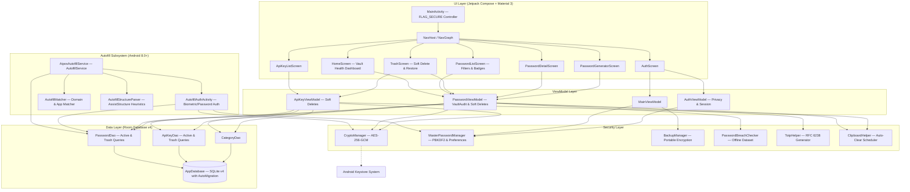

# AIPOS Password Manager — Architecture & Technical Specifications

## 1. Executive Summary

**AIPOS Password Manager** (`com.aipos.aipospm`) is a 100% offline, local-first Android application designed with zero network dependencies (`INTERNET` permission is omitted in `AndroidManifest.xml`). It combines hardware-backed encryption via the **Android Keystore**, modern Jetpack Compose UI with Material 3 styling, and a clean **MVVM (Model-View-ViewModel)** architecture.

---

## 2. Layered Architecture

---

## 3. Component Breakdown

### 3.1 UI Layer (`com.aipos.aipospm.ui`)
- **`MainActivity.kt`**: Single-activity entry point. Configures window insets, Material 3 theme wrapper, biometric prompt handlers, dynamic `WindowManager.LayoutParams.FLAG_SECURE` window binding, and main Scaffold bottom navigation.
- **`HomeScreen.kt`**: Vault Health dashboard featuring an animated circular score gauge, quick summary metrics, favorites carousel, and direct action banners for compromised (Red) and reused (Amber) entries.
- **`PasswordListScreen.kt`**: Passwords list view with search, custom category chips, `Compromised (N)` and `Reused (N)` filter chips, swipe-to-delete gesture, and Scaffold FAB lifting over snackbars.
- **`TrashScreen.kt`**: Full-fledged soft-delete recovery center with dual tabs ("Passwords" & "API Keys"), 30-day auto-purge notices, countdown badges, individual restore/permanent delete, and empty trash actions.
- **`ApiKeyListScreen.kt`**: Tailored developer interface for API keys with notes, category filtering, and swipe-to-delete.
- **`PasswordDetailScreen.kt` & `ApiKeyDetailScreen.kt`**: Detail screens featuring inline 2FA TOTP live countdown rings, password visibility toggles, strength meters, and edit modals.

### 3.2 Security Layer (`com.aipos.aipospm.security`)
- **`CryptoManager.kt`**: Encrypts and decrypts string payloads using **AES-256-GCM** with 128-bit authentication tags and hardware-backed keys stored inside `AndroidKeyStore`.
- **`MasterPasswordManager.kt`**: Hashes master passwords using **PBKDF2WithHmacSHA256** with 120,000 iterations and a 16-byte random salt. Also manages encrypted preferences including biometric preferences and `FLAG_SECURE` screen privacy toggle (`KEY_SCREEN_SECURITY_ENABLED`).
- **`BackupManager.kt`**: Generates and parses encrypted JSON backups decoupled from hardware Keystore keys, utilizing a user-specified backup password derived via PBKDF2 (10,000 iterations) + AES-256-GCM.
- **`PasswordBreachChecker.kt`**: Evaluates passwords locally against a bundled dataset of breached passwords without any network requests.
- **`TotpHelper.kt`**: Computes time-based one-time passwords (RFC 6238) offline from Base32 secrets.

### 3.3 Data Layer (`com.aipos.aipospm.data`)
- **`AppDatabase.kt`**: Room database singleton containing entities for `PasswordEntry`, `ApiKeyEntry`, and `CategoryEntity`. Database version 4 with `@AutoMigration(from = 3, to = 4)`.
- **`PasswordEntry.kt` & `ApiKeyEntry.kt`**: Include `@ColumnInfo(defaultValue = "0") val isDeleted: Boolean` and `val deletedAt: Long?` to support non-destructive soft deletes.
- **`PasswordDao.kt` & `ApiKeyDao.kt`**: Data access objects returning asynchronous Kotlin `Flow` pipelines. Active views filter on `WHERE isDeleted = 0`, while dedicated queries handle trash list, recovery, and 30-day cutoff auto-purges.

### 3.4 Autofill Subsystem (`com.aipos.aipospm.autofill`)
- **`AiposAutofillService.kt`**: Extends Android's `android.service.autofill.AutofillService` (API 26+). Intercepts system fill requests, invokes parser and matching pipelines, and constructs authentication-protected `Dataset` bundles.
- **`AutofillStructureParser.kt`**: Recursively parses `AssistStructure.ViewNode` trees to discover `AutofillId`s for username, email, and password fields, along with target web domains (`node.webDomain`).
- **`AutofillMatcher.kt`**: Scores and ranks active vault credentials against extracted web domains and Android package name tokens (e.g. `com.spotify.music` -> `spotify`).
- **`AutofillAuthActivity.kt`**: Overlay activity triggered when an autofill suggestion is tapped. Performs biometric or master password verification, decrypts the requested credential via `CryptoManager`, and returns the unlocked dataset to the calling app with `AutofillManager.EXTRA_AUTHENTICATION_RESULT`.

---

## 4. Performance Optimizations

1. **Background Thread Offloading & Unified Single-Pass Vault Audit**:
   - Cryptographic Keystore calls (`CryptoManager.encrypt/decrypt`) are heavy operations.
   - `PasswordViewModel` executes a single unified `vaultAudit` pipeline on `Dispatchers.Default` (debounced by 300ms) that evaluates both breached passwords and reused password duplicate sets in a single pass over active credentials.
2. **Debounced Database Emissions**:
   - Room emissions are debounced (`.debounce(300L)`) to group rapid database insertions or bulk imports into a single Keystore evaluation sweep.
3. **Recomposition Guarding**:
   - Category color resolution (`getCategoryColors`) and ID-to-name mapping utilize `remember(categories)` inside `LazyColumn` items to prevent redundant lookup computations during scrolling.

