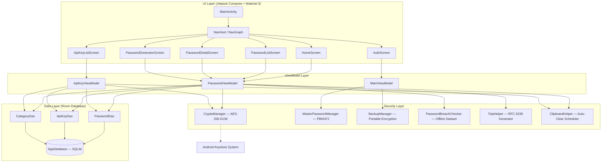

# AIPOS Password Manager — Architecture & Technical Specifications

## 1. Executive Summary

**AIPOS Password Manager** (`com.aipos.aipospm`) is a 100% offline, local-first Android application designed with zero network dependencies (`INTERNET` permission is omitted in `AndroidManifest.xml`). It combines hardware-backed encryption via the **Android Keystore**, modern Jetpack Compose UI with Material 3 styling, and a clean **MVVM (Model-View-ViewModel)** architecture.

---

## 2. Layered Architecture

---

## 3. Component Breakdown

### 3.1 UI Layer (`com.aipos.aipospm.ui`)
- **`MainActivity.kt`**: Single-activity entry point. Configures window insets, Material 3 theme wrapper, biometric prompt handlers, and main Scaffold bottom navigation.
- **`HomeScreen.kt`**: Vault Health dashboard featuring an animated circular score gauge, quick summary metrics, favorites carousel, and direct action banners for compromised entries.
- **`PasswordListScreen.kt`**: Passwords list view with search, custom category chips, red `Compromised (N)` filter chip, swipe-to-delete gesture, and Scaffold FAB lifting over snackbars.
- **`ApiKeyListScreen.kt`**: Tailored developer interface for API keys with notes, category filtering, and swipe-to-delete.
- **`PasswordDetailScreen.kt` & `ApiKeyDetailScreen.kt`**: Detail screens featuring inline 2FA TOTP live countdown rings, password visibility toggles, strength meters, and edit modals.

### 3.2 Security Layer (`com.aipos.aipospm.security`)
- **`CryptoManager.kt`**: Encrypts and decrypts string payloads using **AES-256-GCM** with 128-bit authentication tags and hardware-backed keys stored inside `AndroidKeyStore`.
- **`MasterPasswordManager.kt`**: Hashes master passwords using **PBKDF2WithHmacSHA256** with 120,000 iterations and a 16-byte random salt.
- **`BackupManager.kt`**: Generates and parses encrypted JSON backups decoupled from hardware Keystore keys, utilizing a user-specified backup password derived via PBKDF2 (10,000 iterations) + AES-256-GCM.
- **`PasswordBreachChecker.kt`**: Evaluates passwords locally against a bundled dataset of breached passwords without any network requests.
- **`TotpHelper.kt`**: Computes time-based one-time passwords (RFC 6238) offline from Base32 secrets.

### 3.3 Data Layer (`com.aipos.aipospm.data`)
- **`AppDatabase.kt`**: Room database singleton containing entities for `PasswordEntry`, `ApiKeyEntry`, and `CategoryEntity`.
- **`PasswordDao.kt`**, **`ApiKeyDao.kt`**, **`CategoryDao.kt`**: Data access objects returning asynchronous Kotlin `Flow` pipelines.

---

## 4. Performance Optimizations

1. **Background Thread Offloading**:
   - Cryptographic Keystore calls (`CryptoManager.encrypt/decrypt`) are heavy operations. `PasswordViewModel` and `ApiKeyViewModel` apply `.flowOn(Dispatchers.Default)` to `StateFlow` transformations so search filtering and decryption take place off the UI main thread.
2. **Debounced Database Emissions**:
   - `breachedPasswordCount` applies `.debounce(300L)` on Room emissions to group rapid database insertions (e.g. during CSV imports of 200+ items) into a single evaluation sweep, avoiding hundreds of redundant Keystore calls.
3. **Recomposition Guarding**:
   - Category color resolution (`getCategoryColors`) and ID-to-name mapping utilize `remember(categories)` inside `LazyColumn` items to prevent redundant lookup computations during scrolling.
