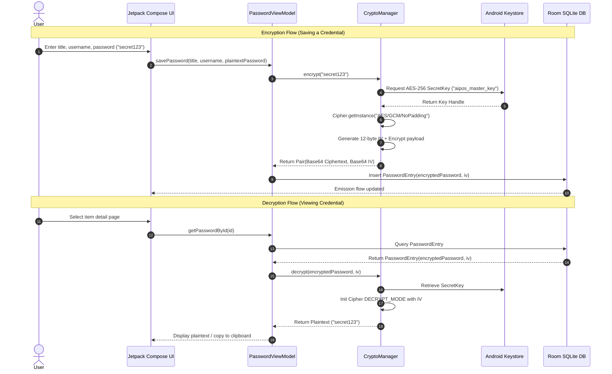

# AIPOS Password Manager — Security Specifications & Threat Model

## 1. Security Architecture Principles

AIPOS Password Manager is engineered around three core security tenets:
1. **Zero-Trust Local-First**: 100% offline data retention. No external server, no analytics, no cloud telemetry, and zero network permissions (`android.permission.INTERNET` is omitted).
2. **Hardware-Backed Cryptography**: All vault entries stored on device are encrypted with keys backed by the hardware **Android Keystore** (TEE/SE when available).
3. **Defense in Depth**: Master password hashing with PBKDF2 (120,000 iterations), auto-clearing clipboards, biometric authentication (`BIOMETRIC_STRONG`), and portable backup encryption.

---

## 2. Cryptographic Specifications

| Security Domain | Algorithm / Parameter | Implementation Details |
|---|---|---|
| **Vault Encryption at Rest** | AES-256-GCM | 256-bit key stored in `AndroidKeyStore`. 12-byte IV generated randomly per payload. 128-bit authentication tag. |
| **Master Password Hashing** | PBKDF2WithHmacSHA256 | 120,000 iterations + 16-byte cryptographically secure random salt (`SecureRandom`). |
| **Backup Encryption** | PBKDF2 + AES-256-GCM | 10,000 iterations for backup key derivation using user backup password. Allows cross-device restoration without hardware key dependency. |
| **Metadata Security** | EncryptedSharedPreferences | Keys encrypted using `AES256_SIV`, values using `AES256_GCM`. Stores master salt and hashed verification tokens. |
| **Biometric Authentication** | AndroidX Biometric API | Enforces `BIOMETRIC_STRONG` (hardware fingerprint / 3D face recognition). |

---

## 3. Data Flow & Encryption Pipeline

---

## 4. Threat Model & Mitigations

### 4.1 Threat: Device Loss or Physical Access
- **Mitigation**: Database payload is encrypted with AES-256-GCM. Unlocking requires either the user's master password (derived via 120,000 PBKDF2 iterations) or strong biometric verification (`BIOMETRIC_STRONG`).
- **Auto-Lock**: Inactivity timer automatically locks the application when backgrounded.

### 4.2 Threat: Memory Inspection & Clipboard Snooping
- **Mitigation**: `ClipboardHelper` schedules an automatic clipboard clear 30 seconds after copying credentials. Sequential copies cancel and reschedule prior clear timers to prevent race conditions.

### 4.3 Threat: Weak Master Passwords & Breached Credentials
- **Mitigation**: Real-time offline evaluation against a local breached password dataset (`PasswordBreachChecker`). Prompts users when master passwords or entry credentials match known compromised lists.

### 4.4 Threat: Screen Scraping, Surveillance & Screenshot Malware
- **Mitigation**: The app leverages Android's `WindowManager.LayoutParams.FLAG_SECURE` to block screenshots, screen recording tools, and prevent the app window from being rendered in plain text inside the OS Recent Apps overview / task switcher.
- **Granular User Control**: Users can adjust this setting under *Settings > Security > Screen Privacy*, with the default strictly set to enabled for maximum privacy.

### 4.5 Threat: Malicious App Phishing & Unauthorized Autofill Interception
- **Mitigation**: The `AiposAutofillService` NEVER returns plaintext decrypted credentials in initial `FillResponse` datasets.
- **Authenticated Datasets**: Every autofill suggestion attaches an `IntentSender` targeting `AutofillAuthActivity`. The Android OS only receives decrypted credentials after the user explicitly authorizes the fill action via `BIOMETRIC_STRONG` (fingerprint/face) or the Master Password.
- **Domain & Package Validation**: Credentials are only suggested when the calling app's package name or the browser's web domain positively matches verified vault entries.

### 4.6 Threat: In-Memory Plaintext Retention & Decryption Cache Exposure
- **Mitigation**: The in-memory session decryption cache (`ConcurrentHashMap<String, String>`) exists strictly in volatile RAM within `PasswordViewModel` to accelerate recurring vault health audits and UI list lookups during an active authenticated session without repeated hardware Keystore round-trips.
- **Zero Disk Persistence**: The cache is purely transient and is never serialized, logged, or written to SQLite or SharedPreferences.
- **Immediate Lifecycle Flushing**: Whenever the application is locked (via manual lock action, biometric auto-lock timeout, or app lifecycle transition to background), `passwordViewModel.clearDecryptionCache()` is invoked immediately in `MainActivity.kt` before the screen lock overlay is mounted, clearing all cached plaintexts from memory.

